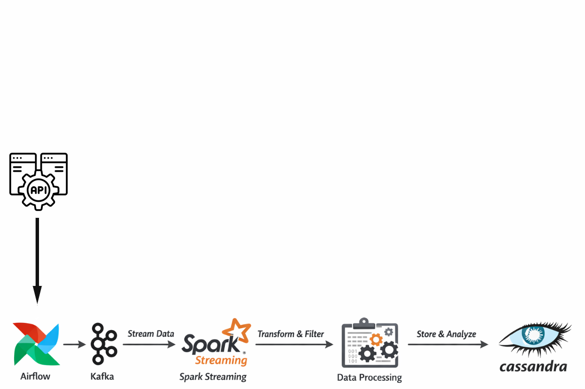

````markdown


# Real-Time Data Pipeline: API to Cassandra via Kafka & Spark

This project implements a scalable, real-time data engineering pipeline that fetches user data from an external API, streams it through a message broker, processes it using distributed computing, and stores the final result in a NoSQL database for analytical use.

## Project Architecture

The pipeline follows a modern "Medallion" inspired streaming architecture:

- **Orchestration (Apache Airflow):** Triggers a PythonOperator to fetch data from the RandomUser API and produce messages to Kafka.  
- **Ingestion (Apache Kafka):** Acts as the decoupled message buffer, holding raw JSON data in the `random_users` topic.  
- **Processing (Apache Spark Structured Streaming):** Consumes the stream, flattens the nested JSON, performs data cleaning/type casting, and handles schema enforcement.  
- **Storage (Apache Cassandra):** Serves as the sink for the processed high-velocity data, organized for efficient time-series or user-based queries.

## Tech Stack

- **Orchestration:** Apache Airflow  
- **Message Broker:** Apache Kafka  
- **Stream Processing:** Apache Spark (Structured Streaming)  
- **Database:** Apache Cassandra  
- **Language:** Python (PySpark, Kafka-Python)  
- **Containerization:** Docker & Docker Compose

## Preprocessing & Transformations

The Spark engine performs several critical "Bronze to Silver" level transformations:

- **Flattening:** Expands nested JSON structures (e.g., location, name, login) into a flat tabular schema.  
- **Data Cleaning:** Standardizes gender strings, trims whitespace, and handles missing values using default constants.  
- **Type Casting:** Converts string coordinates to Double and ISO-8601 strings to Spark Timestamp objects.  
- **Security:** Filters out sensitive authentication fields (passwords, salts, hashes) before storage.  
- **Deduplication:** Uses the `login.uuid` as a primary key to ensure data integrity in Cassandra.

## Setup and Installation

1. **Prerequisites**  
   - Docker and Docker Compose installed.  
   - Spark 3.5.x and Cassandra 3.x/4.x.

2. **Infrastructure Setup**  
   Ensure your Docker containers for Kafka and Cassandra are running:  
   ```bash
   docker-compose up -d
````

3. **Kafka Topic Creation**

   ```bash
   docker exec -it kafka_job1 kafka-topics --create --topic random_users --bootstrap-server localhost:9092
   ```

4. **Running the Pipeline**

   * **Airflow:** Enable the `stream_randomuser_to_kafka` DAG to start the producer.
   * **Spark:** Submit the streaming job:

   ```bash
   spark-submit --packages org.apache.spark:spark-sql-kafka-0-10_2.12:3.5.0,com.datastax.spark:spark-cassandra-connector_2.12:3.4.1 main_script.py
   ```

## Data Schema (Cassandra)

The `user_data.users` table is defined as follows:

| Column            | Type      | Description               |
| ----------------- | --------- | ------------------------- |
| user_id           | TEXT      | Primary Key (UUID)        |
| first_name        | TEXT      | User first name           |
| email             | TEXT      | Validated email address   |
| address           | TEXT      | Concatenated full address |
| date_of_birth     | TIMESTAMP | Converted DOB             |
| registration_date | TIMESTAMP | Spark-processed timestamp |

## Future Enhancements

* **Monitoring:** Integrate Prometheus and Grafana for Spark UI and Kafka lag monitoring.
* **Data Quality:** Implement Great Expectations for real-time data validation.
* **Dashboarding:** Build a PowerBI or Grafana dashboard directly on top of the Cassandra keyspace.


Do you want me to do that next?
```
